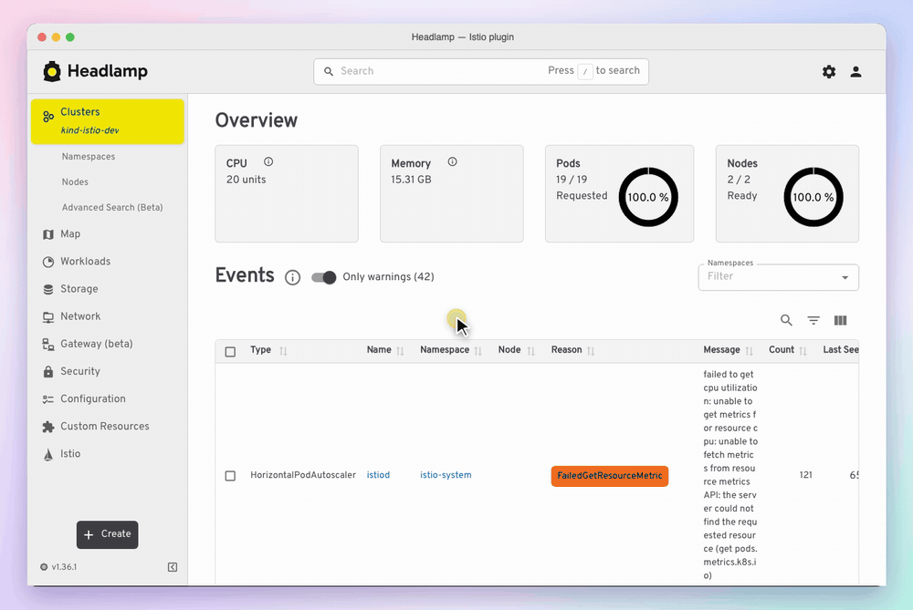
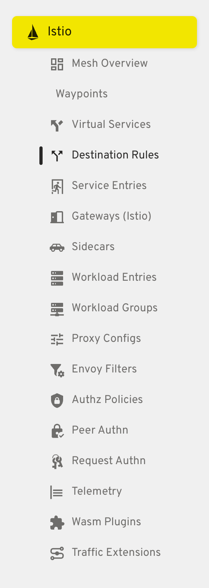
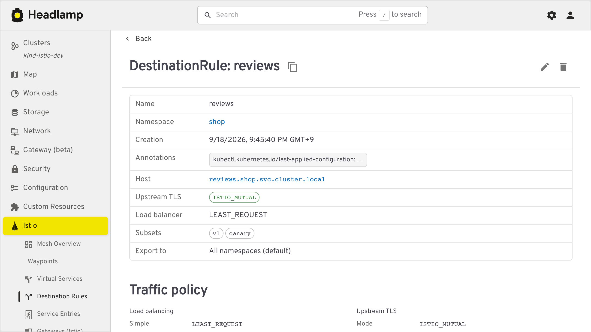
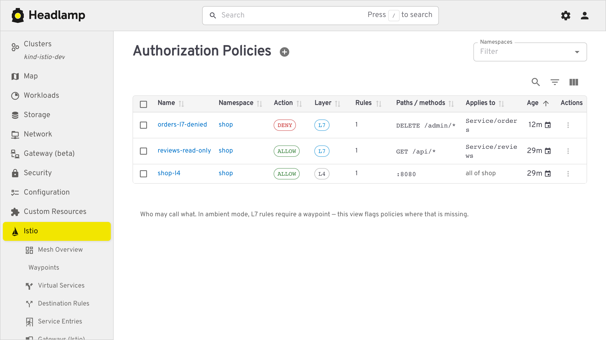
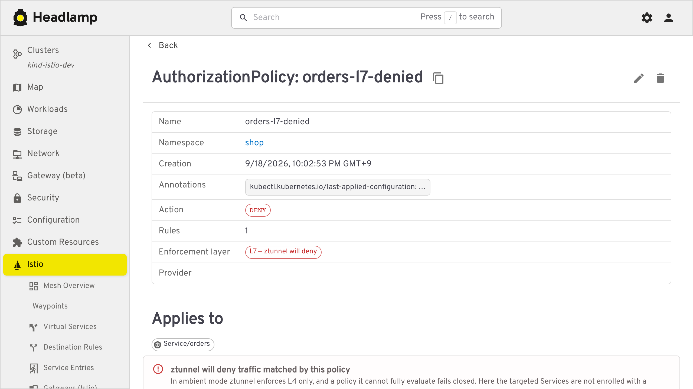
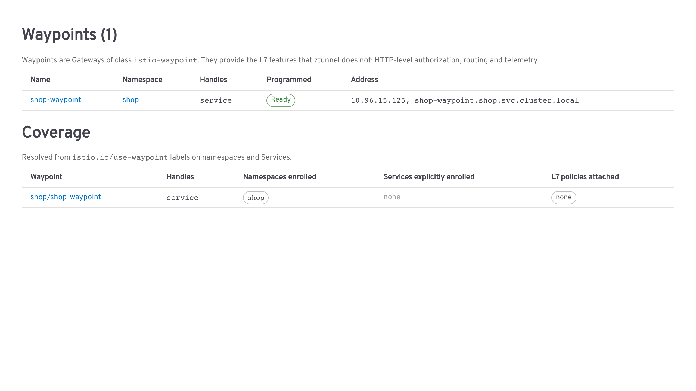
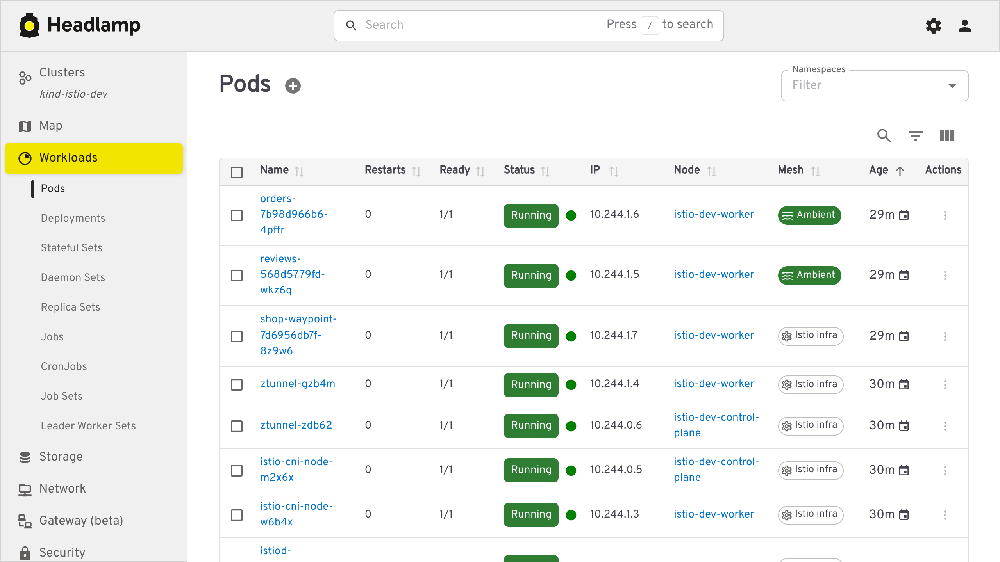
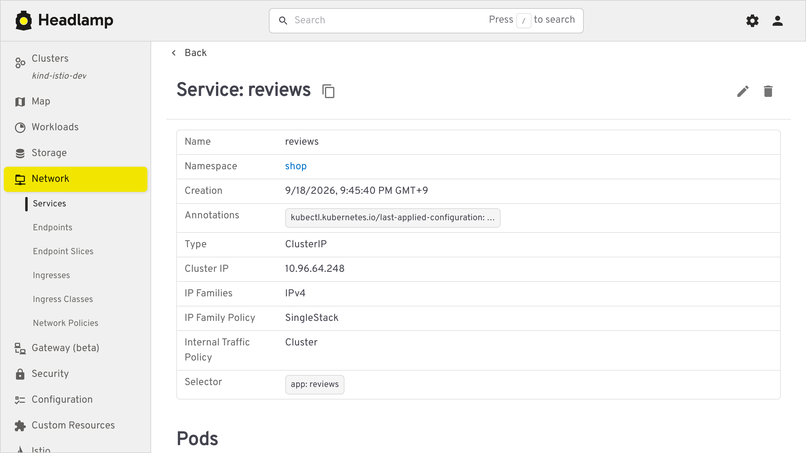

# istio-headlamp-plugin

[](https://artifacthub.io/packages/search?repo=istio-headlamp-plugin)
[](https://github.com/eottabom/istio-headlamp-plugin/actions/workflows/ci.yml)

An Istio service mesh plugin for [Headlamp](https://headlamp.dev), built around two things
existing Istio UIs in Headlamp do not do:

**1. Every resource shows its spec, without opening the editor.**
Istio custom resources are almost entirely `spec`. A detail view that renders only metadata
and conditions tells you nothing about a `DestinationRule` or `ServiceEntry`, so you end up
clicking *Edit* just to read the configuration. Here, typed sections render the parts we
model, and a generic recursive renderer covers everything else, including fields added by
Istio releases newer than this plugin.

**2. Ambient mode is first-class.**
Waypoints, ztunnel, `istio-cni`, namespace enrolment and the L4/L7 split are surfaced
directly, including the case where an L7 `AuthorizationPolicy` reaches ztunnel instead of a
waypoint and fails closed, denying the traffic it was meant to filter.



## Install

### Download the GitHub release package

Download [`istio-headlamp-plugin-0.1.4.tar.gz`](https://github.com/eottabom/istio-headlamp-plugin/releases/download/v0.1.5/istio-headlamp-plugin-0.1.5.tar.gz)
from [GitHub Releases](https://github.com/eottabom/istio-headlamp-plugin/releases).
Use the plugin `.tar.gz` asset under **Assets**, not GitHub's **Source code** archives.
The package contains the built plugin; Node.js and npm are not needed to install it.

### Headlamp desktop (Linux / macOS)

Download and extract the package into the desktop app's plugin directory:

```sh
VERSION=0.1.5
ARCHIVE="istio-headlamp-plugin-${VERSION}.tar.gz"
curl -fL --output "$ARCHIVE" \
  "https://github.com/eottabom/istio-headlamp-plugin/releases/download/v${VERSION}/${ARCHIVE}"
mkdir -p "$HOME/.config/Headlamp/plugins"
tar -xzf "$ARCHIVE" -C "$HOME/.config/Headlamp/plugins"
```

On Windows, extract the same package into `%APPDATA%\Headlamp\Config\plugins`.
Restart Headlamp after installing. The extracted layout must be:

```text
plugins/
└── istio-headlamp-plugin/
    ├── main.js
    └── package.json
```

Keep any other files included in the package alongside these files.

### Headlamp in a cluster or container (GitHub Packages)

The [GitHub Package](https://github.com/eottabom/istio-headlamp-plugin/pkgs/container/istio-headlamp-plugin)
`ghcr.io/eottabom/istio-headlamp-plugin:0.1.5` contains the same built plugin at
`/plugins/istio-headlamp-plugin`. It is a plugin delivery image, not a Headlamp server.

Add these fields to your Headlamp Deployment's Pod spec, retaining its existing image,
arguments, credentials and other settings:

```yaml
spec:
  template:
    spec:
      initContainers:
        - name: install-istio-plugin
          image: ghcr.io/eottabom/istio-headlamp-plugin:0.1.5
          command: ["/bin/sh", "-c"]
          args: ["cp -R /plugins/. /headlamp/plugins/"]
          volumeMounts:
            - name: headlamp-plugins
              mountPath: /headlamp/plugins
      containers:
        - name: headlamp # match your existing Headlamp container name
          # Keep your existing image and args; add -plugins-dir=/headlamp/plugins.
          volumeMounts:
            - name: headlamp-plugins
              mountPath: /headlamp/plugins
      volumes:
        - name: headlamp-plugins
          emptyDir: {}
```

This is a Deployment fragment, not a standalone manifest. If you already mount a plugin
volume, reuse it instead of replacing it. The init container copies the plugin before
Headlamp starts; configure Headlamp with `-plugins-dir=/headlamp/plugins` to load it.

For a local container, populate a directory with the package and mount it into Headlamp:

```sh
mkdir -p ./headlamp-plugins
docker run --rm \
  -v "$PWD/headlamp-plugins:/headlamp/plugins" \
  ghcr.io/eottabom/istio-headlamp-plugin:0.1.5
```

Mount that directory at `/headlamp/plugins` in your Headlamp container. Alternatively,
extract the release tarball into the same directory. See Headlamp's
[deployment guide](https://headlamp.dev/docs/latest/development/plugins/building/)
for plugin volumes and init containers.

### Plugin Catalog (desktop only)

If your desktop app includes **Plugin Catalog**, you can also search there for **Istio**.
This is a community plugin, so you may need to allow non-official plugins in the catalog.
Check that the source is `eottabom/istio-headlamp-plugin` before installing.
The **Plugins** settings page and the in-cluster UI are not the desktop Plugin Catalog.
[Artifact Hub](https://artifacthub.io/packages/headlamp/istio-headlamp-plugin/istio-headlamp-plugin)
indexes the package; its archive is hosted on GitHub Releases.

### Build a package from source

For development, use Node.js 22 and build the same installable archive:

```sh
git clone https://github.com/eottabom/istio-headlamp-plugin.git
cd istio-headlamp-plugin
npm ci
npm run build
npm run package
```

Install the resulting `istio-headlamp-plugin-<version>.tar.gz` using the extraction
steps above. When copying a build manually, copy the **contents** of `dist/` and
`package.json` into `plugins/istio-headlamp-plugin/`; `main.js` must be directly inside
that directory, not inside a nested `dist/` directory. `dev/deploy.sh` copies this
layout to the Linux/macOS desktop directory and any additional paths you pass to it.

### What it needs to read

The plugin needs read access to:

- **Istio APIs:** networking.istio.io, security.istio.io, telemetry.istio.io, extensions.istio.io
- **Gateway API:** Gateway objects
- **Kubernetes resources:** Namespaces, Services, Pods, Deployments and DaemonSets

Views that cannot read something say so rather than guessing.

## Features

Every Istio resource gets its own entry in the sidebar, and only for CRDs the cluster
actually has.



### Spec-first detail views

| Resource | What the detail page shows |
|---|---|
| `DestinationRule` | Load balancing, connection pool (TCP + HTTP), outlier detection, upstream TLS, subsets with per-subset overrides, port-level settings |
| `ServiceEntry` | Hosts, location, resolution, ports, endpoints table, and a warning when the combination silently does nothing (e.g. `STATIC` with no endpoints) |
| `VirtualService` | Per-route match summary, weighted destinations with a total-weight check, timeouts/retries/fault/mirror |
| `Gateway` (Istio API) | Servers table with port, protocol, hosts, TLS mode and credential |
| `AuthorizationPolicy` | Action, rules as from/to/when, and the ambient L7 enforcement check |
| `PeerAuthentication` | mTLS mode, port-level overrides, warnings for `PERMISSIVE` and `DISABLE` |
| `RequestAuthentication` | JWT rules with issuer, audiences, JWKS source and token location |
| `Telemetry` | Tracing, metrics and access logging, with sampling percentage |
| `WasmPlugin` | URL, phase, priority and plugin config |
| `Sidecar`, `WorkloadEntry`, `WorkloadGroup`, `ProxyConfig`, `EnvoyFilter`, `TrafficExtension` | Typed header fields plus the full spec renderer |



Lists carry the fields that make a resource identifiable, so a page of policies is readable
without opening any of them.



Every page ends with a **Full spec** section, so nothing in the resource is ever hidden.

### Ambient mode

- **Mesh Overview**: control-plane version, ztunnel and `istio-cni` DaemonSet health,
  ambient vs sidecar namespace counts, installed Istio APIs.
- **Waypoints**: every `istio-waypoint` Gateway, what it is enrolled for (resolved by
  scanning `istio.io/use-waypoint` labels across namespaces and Services), attached L7
  policies, and a warning for waypoints nothing routes through.
- **L7 enforcement check**: an `AuthorizationPolicy` using HTTP methods, paths, hosts or
  JWT claims is checked against what actually enforces it. Two Istio rules decide this, and
  both are easy to get wrong by hand:
  - only a `targetRef` attaches a policy to a waypoint. A `selector`, or neither, leaves the
    policy with ztunnel however the namespace is labelled.
  - ztunnel cannot evaluate L7, and does not skip what it cannot evaluate: the policy
    **fails closed and denies**.

  So the page names the enforcement point rather than guessing. A `use-waypoint` label is
  checked against the Gateways that exist, because a typo in that label otherwise reads as
  full coverage. When the mesh state, Services or Namespaces cannot be read, the page says
  it cannot determine enforcement instead of assuming.

  

  Above: a `DENY` policy with HTTP conditions, attached by `targetRef` to a Service that opted
  out of its waypoint. ztunnel ends up enforcing it, cannot evaluate the conditions, and denies.
- **Mesh column**: Headlamp's own Pod and workload lists gain an `Ambient` / `Sidecar` /
  `Out of mesh` column.





### Istio context on built-in pages

Istio sections are injected into Headlamp's own resource views:

- **Service** → VirtualServices routing to it, DestinationRules for its host, ServiceEntries
  claiming that host, AuthorizationPolicies, and its waypoint.
- **Pod** → mesh state with the reason, proxy image, waypoint.
- **Namespace** → dataplane mode, default waypoint, and the *effective* mTLS mode resolved
  from namespace and mesh-wide `PeerAuthentication`.

The **Istio** section on the `reviews` Service links its routing resources,
authorization policies and waypoint:



## Compatibility

- Istio 1.2x and 1.3x. Each resource registers every API version Istio serves for it
  (`networking.istio.io/v1`, `/v1beta1`, `/v1alpha3`, …) and Headlamp falls back through them.
- Sidebar entries appear only for CRDs actually installed in the cluster.
- Works against sidecar-only meshes; ambient views explain themselves when ztunnel is absent.

## Development

```sh
npm install
npm start          # watch build; open Headlamp desktop to see changes
npm run tsc        # type check
npm run lint       # lint
npm run build      # production build
npm run package    # tarball for distribution
```

### Local dev cluster

The plugin needs a cluster where Istio CRDs are readable; many production SSO roles cannot
list them. `dev/kind-istio-ambient.sh` builds one: kind + Gateway API + Istio ambient, plus
`dev/sample-istio-config.yaml`, which exercises every view, including two deliberately
broken resources (a `STATIC` ServiceEntry with no endpoints, an L7 `AuthorizationPolicy`
targeting a Service that opted out of its waypoint) so the warnings have something to catch.

```sh
./dev/kind-istio-ambient.sh
```

### Tests

The analysis that decides what the UI *claims* about a resource lives in
`src/lib/analyze.ts` and `src/lib/mesh.ts` as pure functions, with no Headlamp or React
imports: which enforcement layer a policy needs, whether a ServiceEntry silently routes
nothing, how a host string resolves. Tests run those against fixtures captured from a real
Istio 1.30.1 ambient cluster, so they check behaviour against the shapes the API server
actually returns:

```sh
npm test
python3 scripts/capture-fixtures.py --context kind-istio-dev   # refresh fixtures
```

`e2e/` holds Playwright tests that load the built plugin into a real Headlamp and check the
pages against the sample mesh: the Istio pages, the L7 enforcement warning, and the sections
added to Headlamp's own Service and Namespace pages. `dev/e2e.sh` starts Headlamp in Docker
on the local dev cluster and runs them; the **E2E** workflow does the same on every push to
`main`.

```sh
./dev/kind-istio-ambient.sh   # once
./dev/e2e.sh                  # extra args go to `playwright test`
```

## Layout

```
src/
  resources/      Typed KubeObject subclasses, one file per Istio API group
  registry/       Single source of truth: resource list -> sidebar, routes, columns, details
  components/
    common/       SpecTree (generic renderer), SpecSection, HostLink, Badges
    detail/       Typed detail sections per resource
  ambient/        Mesh Overview and Waypoints pages
  integration/    Sections and columns injected into Headlamp's built-in views
  lib/            Host/FQDN parsing, mesh membership, CRD and mesh-status detection
```

Adding a resource means adding one entry to `src/registry/resources.tsx`; routes, sidebar
entries, list columns and the detail page are all derived from it.

## Releasing

Run the **Release** workflow with the version without `v`. It verifies the plugin,
publishes the release tarball, updates Artifact Hub metadata, and then calls
**Publish GitHub Package** to publish the same artifact to GHCR for `linux/amd64`
and `linux/arm64`. Container tags use the exact version (for example, `0.1.4`).

The changelog is built from commit subjects since the previous tag: `feat:` becomes
*added*, `fix:` *fixed* and `security:` *security*, in both the GitHub release notes and the
`changes` list Artifact Hub shows in the catalogue. Write those subjects for users.

If image publication fails after the release succeeds, rerun **Publish GitHub Package**
with that existing release version; do not recreate the release. On first publication,
set the package's visibility to **Public** in GitHub's package settings so clusters can
pull it without registry credentials. The image's source label links it to this repository.
