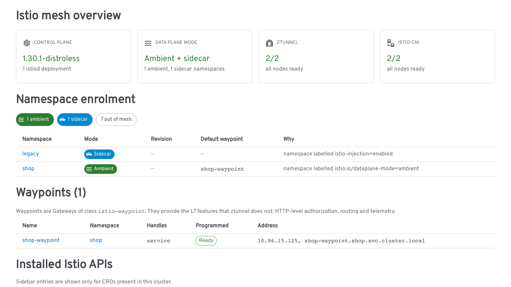

# istio-headlamp-plugin

[](https://artifacthub.io/packages/search?repo=istio-headlamp-plugin)
[](https://github.com/eottabom/istio-headlamp-plugin/actions/workflows/ci.yml)

An Istio service mesh plugin for [Headlamp](https://headlamp.dev), built around two things
existing Istio UIs in Headlamp do not do:

**1. Every resource shows its spec, without opening the editor.**
Istio custom resources are almost entirely `spec`. A detail view that renders only metadata
and conditions tells you nothing about a `DestinationRule` or `ServiceEntry`, so you end up
clicking *Edit* just to read the configuration. Here, typed sections render the parts we
model, and a generic recursive renderer covers everything else, including fields added by
Istio releases newer than this plugin.

**2. Ambient mode is first-class.**
Waypoints, ztunnel, `istio-cni`, namespace enrolment and the L4/L7 split are surfaced
directly, including the case where an L7 `AuthorizationPolicy` reaches ztunnel instead of a
waypoint and fails closed, denying the traffic it was meant to filter.



## Install

### From Headlamp

Open **Plugins** in the Headlamp sidebar, find **Istio**, and install it. The package is on
[Artifact Hub](https://artifacthub.io/packages/search?repo=istio-headlamp-plugin).

### From a release tarball

```sh
VERSION=0.1.1
mkdir -p ~/.config/Headlamp/plugins
curl -fsSL "https://github.com/eottabom/istio-headlamp-plugin/releases/download/v${VERSION}/istio-headlamp-plugin-${VERSION}.tar.gz" \
  | tar xz -C ~/.config/Headlamp/plugins
```

Every version is on the
[releases page](https://github.com/eottabom/istio-headlamp-plugin/releases).

For Headlamp in a container, unpack into the directory it serves plugins from and start it
with `-plugins-dir=/headlamp/plugins`.

### From source

```sh
git clone https://github.com/eottabom/istio-headlamp-plugin.git
cd istio-headlamp-plugin
npm install
npm run build
npm run package     # produces istio-headlamp-plugin-<version>.tar.gz
```

`npm run build` writes `dist/`, which is the plugin itself: copy `dist/` and `package.json`
into a directory named after the plugin under Headlamp's plugins directory. `dev/deploy.sh`
does this for the desktop app and any mounted path at once.

### What it needs to read

The Istio CRDs (`networking.istio.io`, `security.istio.io`, `telemetry.istio.io`,
`extensions.istio.io`), Gateway API `Gateway` objects, and Namespaces, Services, Pods,
Deployments and DaemonSets. Views that cannot read something say so rather than guessing.

## Features

Every Istio resource gets its own entry in the sidebar, and only for CRDs the cluster
actually has. Laid out in columns here; in Headlamp it is one list under **Istio**.


### Spec-first detail views

| Resource | What the detail page shows |
|---|---|
| `DestinationRule` | Load balancing, connection pool (TCP + HTTP), outlier detection, upstream TLS, subsets with per-subset overrides, port-level settings |
| `ServiceEntry` | Hosts, location, resolution, ports, endpoints table, and a warning when the combination silently does nothing (e.g. `STATIC` with no endpoints) |
| `VirtualService` | Per-route match summary, weighted destinations with a total-weight check, timeouts/retries/fault/mirror |
| `Gateway` (Istio API) | Servers table with port, protocol, hosts, TLS mode and credential |
| `AuthorizationPolicy` | Action, rules as from/to/when, and the ambient L7 enforcement check |
| `PeerAuthentication` | mTLS mode, port-level overrides, warnings for `PERMISSIVE` and `DISABLE` |
| `RequestAuthentication` | JWT rules with issuer, audiences, JWKS source and token location |
| `Telemetry` | Tracing, metrics and access logging, with sampling percentage |
| `WasmPlugin` | URL, phase, priority and plugin config |
| `Sidecar`, `WorkloadEntry`, `WorkloadGroup`, `ProxyConfig`, `EnvoyFilter`, `TrafficExtension` | Typed header fields plus the full spec renderer |


Lists carry the fields that make a resource identifiable, so a page of policies is readable
without opening any of them.


Every page ends with a **Full spec** section, so nothing in the resource is ever hidden.

### Ambient mode

- **Mesh Overview**: control-plane version, ztunnel and `istio-cni` DaemonSet health,
  ambient vs sidecar namespace counts, installed Istio APIs.
- **Waypoints**: every `istio-waypoint` Gateway, what it is enrolled for (resolved by
  scanning `istio.io/use-waypoint` labels across namespaces and Services), attached L7
  policies, and a warning for waypoints nothing routes through.
- **L7 enforcement check**: an `AuthorizationPolicy` using HTTP methods, paths, hosts or
  JWT claims is checked against what actually enforces it. Two Istio rules decide this, and
  both are easy to get wrong by hand:
  - only a `targetRef` attaches a policy to a waypoint. A `selector`, or neither, leaves the
    policy with ztunnel however the namespace is labelled.
  - ztunnel cannot evaluate L7, and does not skip what it cannot evaluate: the policy
    **fails closed and denies**.

  So the page names the enforcement point rather than guessing. A `use-waypoint` label is
  checked against the Gateways that exist, because a typo in that label otherwise reads as
  full coverage. When the mesh state, Services or Namespaces cannot be read, the page says
  it cannot determine enforcement instead of assuming.

  

  Above: a `DENY` policy with HTTP conditions, attached by `targetRef` to a Service that opted
  out of its waypoint. ztunnel ends up enforcing it, cannot evaluate the conditions, and denies.
- **Mesh column**: Headlamp's own Pod and workload lists gain an `Ambient` / `Sidecar` /
  `Out of mesh` column.


### Istio context on built-in pages

Istio sections are injected into Headlamp's own resource views:

- **Service** → VirtualServices routing to it, DestinationRules for its host, ServiceEntries
  claiming that host, AuthorizationPolicies, and its waypoint.
- **Pod** → mesh state with the reason, proxy image, waypoint.
- **Namespace** → dataplane mode, default waypoint, and the *effective* mTLS mode resolved
  from namespace and mesh-wide `PeerAuthentication`.


## Compatibility

- Istio 1.2x and 1.3x. Each resource registers every API version Istio serves for it
  (`networking.istio.io/v1`, `/v1beta1`, `/v1alpha3`, …) and Headlamp falls back through them.
- Sidebar entries appear only for CRDs actually installed in the cluster.
- Works against sidecar-only meshes; ambient views explain themselves when ztunnel is absent.

## Development

```sh
npm install
npm start          # watch build; open Headlamp desktop to see changes
npm run tsc        # type check
npm run lint       # lint
npm run build      # production build
npm run package    # tarball for distribution
```

### Local dev cluster

The plugin needs a cluster where Istio CRDs are readable; many production SSO roles cannot
list them. `dev/kind-istio-ambient.sh` builds one: kind + Gateway API + Istio ambient, plus
`dev/sample-istio-config.yaml`, which exercises every view, including two deliberately
broken resources (a `STATIC` ServiceEntry with no endpoints, an L7 `AuthorizationPolicy`
targeting a Service that opted out of its waypoint) so the warnings have something to catch.

```sh
./dev/kind-istio-ambient.sh
```

### Tests

The analysis that decides what the UI *claims* about a resource lives in
`src/lib/analyze.ts` and `src/lib/mesh.ts` as pure functions, with no Headlamp or React
imports: which enforcement layer a policy needs, whether a ServiceEntry silently routes
nothing, how a host string resolves. Tests run those against fixtures captured from a real
Istio 1.30.1 ambient cluster, so they check behaviour against the shapes the API server
actually returns:

```sh
npm test
python3 scripts/capture-fixtures.py --context kind-istio-dev   # refresh fixtures
```

## Layout

```
src/
  resources/      Typed KubeObject subclasses, one file per Istio API group
  registry/       Single source of truth: resource list -> sidebar, routes, columns, details
  components/
    common/       SpecTree (generic renderer), SpecSection, HostLink, Badges
    detail/       Typed detail sections per resource
  ambient/        Mesh Overview and Waypoints pages
  integration/    Sections and columns injected into Headlamp's built-in views
  lib/            Host/FQDN parsing, mesh membership, CRD and mesh-status detection
```

Adding a resource means adding one entry to `src/registry/resources.tsx`; routes, sidebar
entries, list columns and the detail page are all derived from it.
